# iOS-10-Sampler

Code examples for new APIs of iOS 10.

## How to build

Just build with Xcode 8.

It can **NOT** run on **Simulator**. (Because it uses Metal.)

## Contents

### Speech Recognition

Speech Recognition demo using Speech Framework. All available languages can be selected.

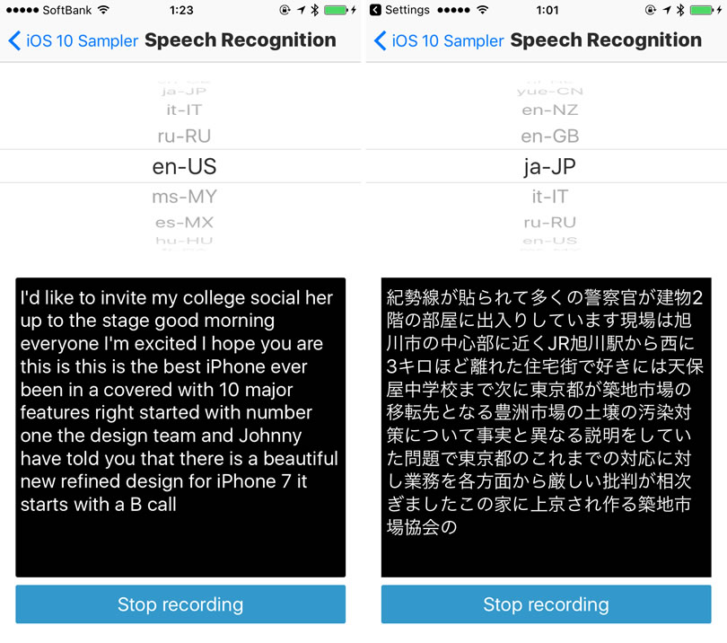

### Looper

Loop playback demo using AVPlayerLooper.

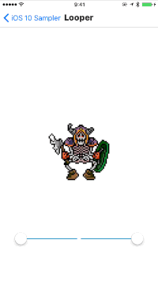 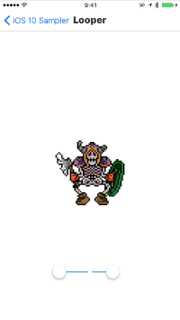
 

### Live Photo Capturing

Live Photo Capturing example using AVCapturePhotoOutput.

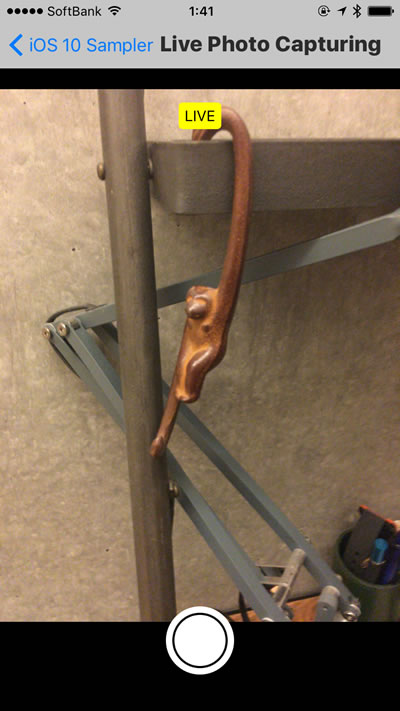

### Audio Fade-in/out

Audio fade-in/out demo using `setVolume:fadeDuration` method which is added to `AVAudioPlayer`.

### Metal CNN Basic: Digit Detection

Hand-writing digit detection using CNN (Convolutional Neural Network) by Metal Performance Shaders.

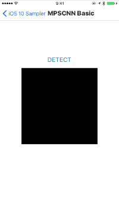

### Metal CNN Advanced: Image Recognition

Real-time image recognition using CNN (Convolutional Neural Network) by Metal Performance Shaders.

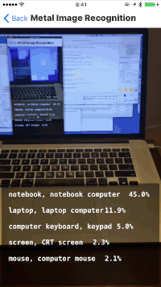

### PropertyAnimator: Position

Animating UIView's `center` & `backgroundColor` using `UIViewPropertyAnimator`.

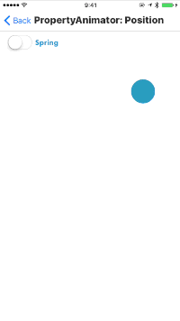

### PropertyAnimator: Blur

Animating blur effect using `fractionComplete` property of `UIViewPropertyAnimator`.

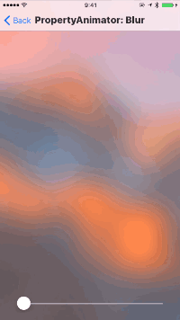

### Preview Interaction

**Peek & Pop interactions with 3D touch** using UIPreviewInteraction.

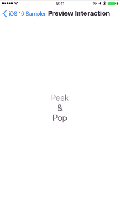

### Notification with Image

Local notification with an image using UserNotifications framework.

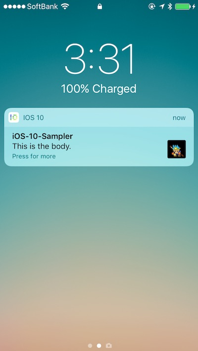 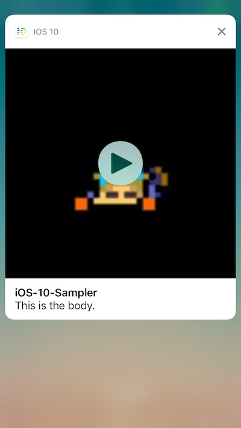
 

### Sticker Pack

Example of Sticker Pack for iMessage.

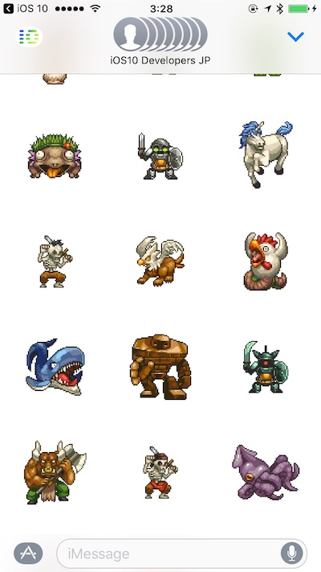

### Core Data Stack (Created by [nolili](https://github.com/nolili))

Simple Core Data stack using NSPersistentContainer.

### TabBar Customization

Customization sample for UITabBar's badge using text attributes.

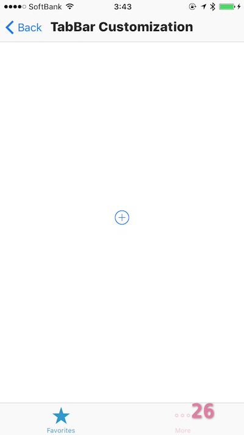

### New filters

New filters of CIFilter in Core Image.

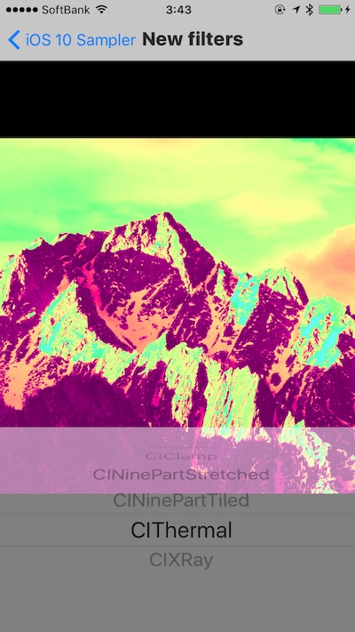 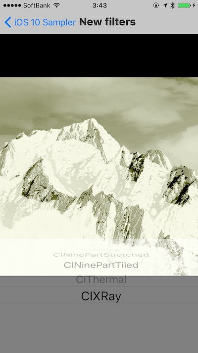
 

### New Fonts

New Fonts gallery

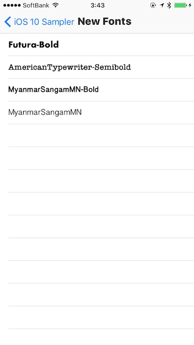

### Proactive: Location Suggestions

This sample demonstrates how to use new `mapItem` property of NSUserActivity to integrate with location suggestions.

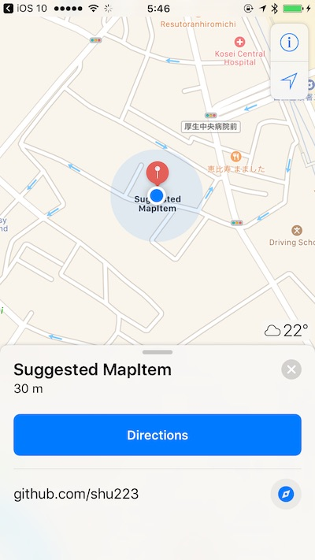 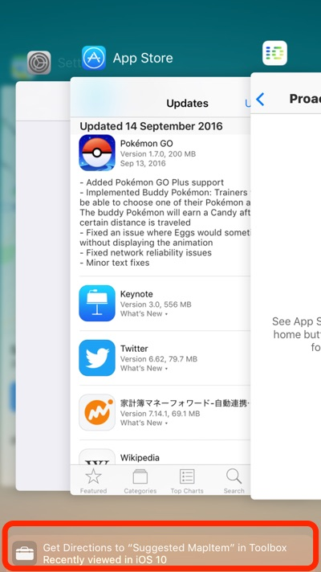
 

### Attributed Speech

Attributed Speech demo with `AVSpeechSynthesisIPANotationAttribute` for `AVSpeechUtterance`. 

### Haptic Feedback

Haptic Feedbacks using UIFeedbackGenerator.

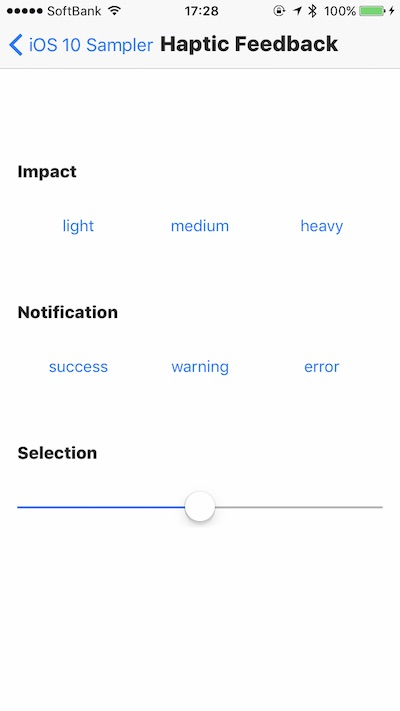

## Author

**Shuichi Tsutsumi**

Freelance iOS programmer in Japan.

- PAST WORKS:  [My Profile Summary](https://medium.com/@shu223/my-profile-summary-f14bfc1e7099#.vdh0i7clr)
- PROFILES: [LinkedIn](https://www.linkedin.com/in/shuichi-tsutsumi-525b755b/)
- BLOGS: [English](https://medium.com/@shu223/) / [Japanese](http://d.hatena.ne.jp/shu223/)
- CONTACTS: [Twitter](https://twitter.com/shu223) / [Facebook](https://www.facebook.com/shuichi.tsutsumi)

## Special Thanks

The icon is designed by [Okazu](https://www.facebook.com/pashimo)
